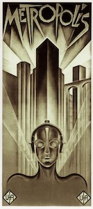
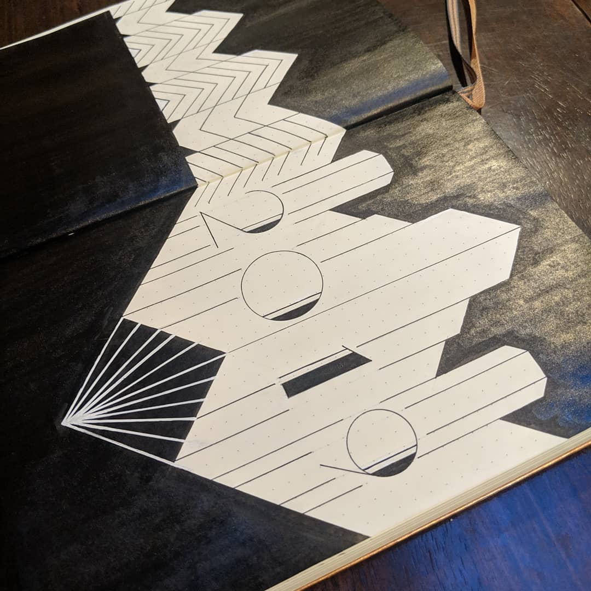
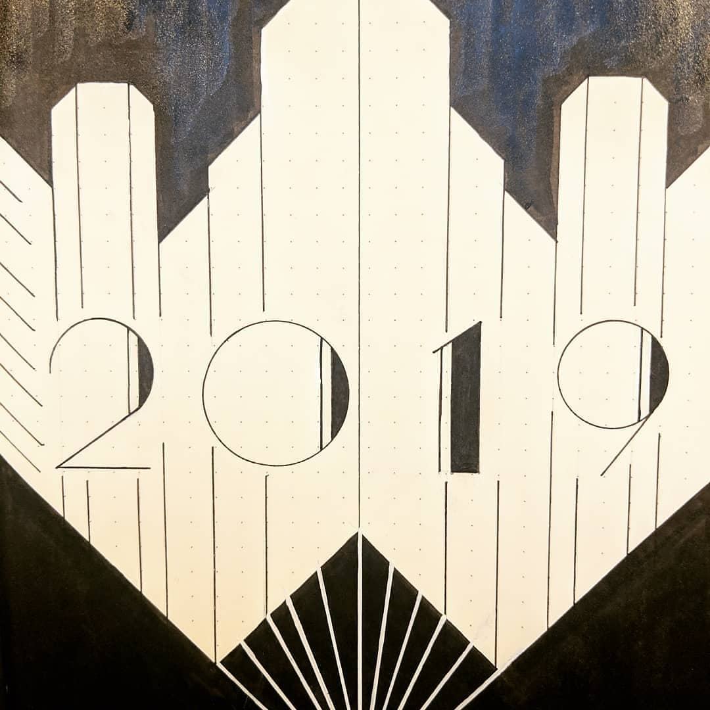
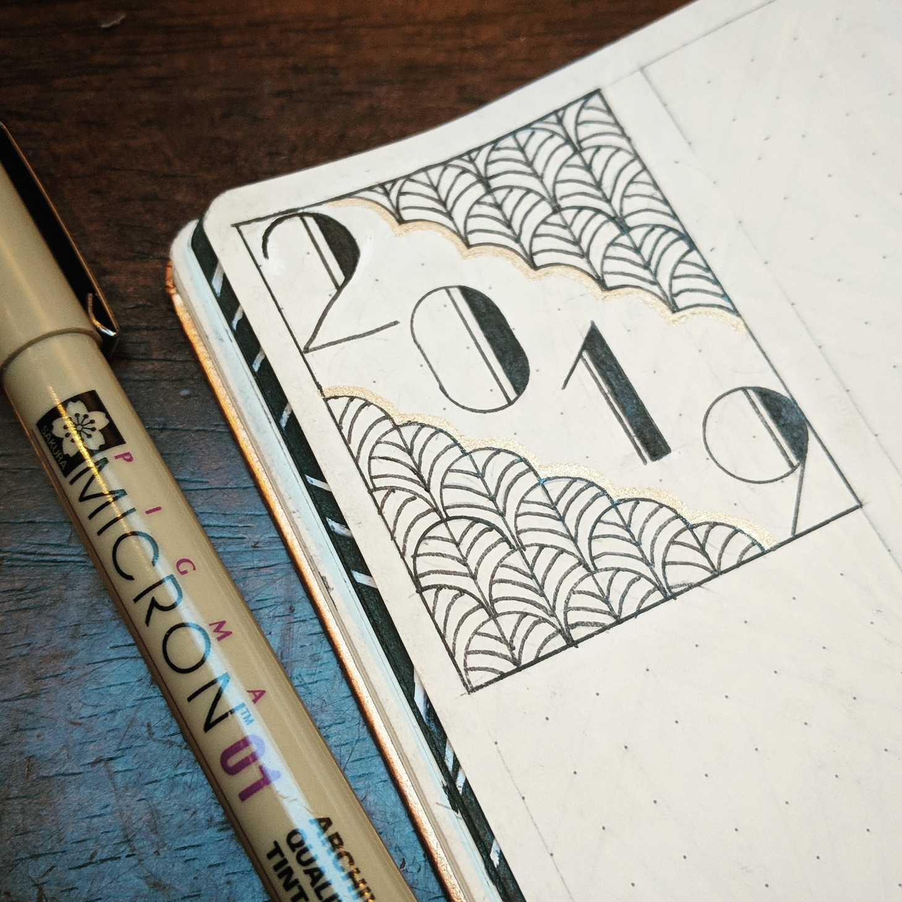
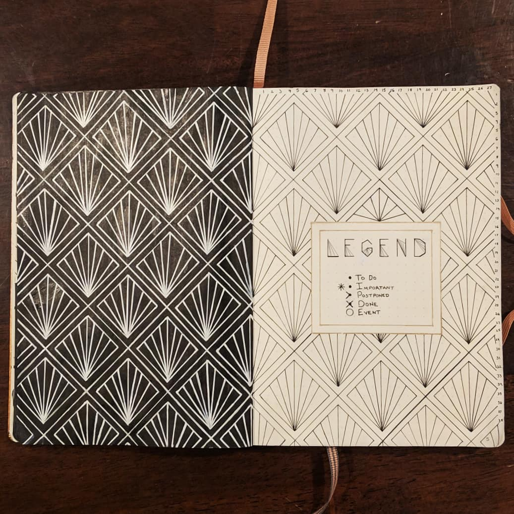
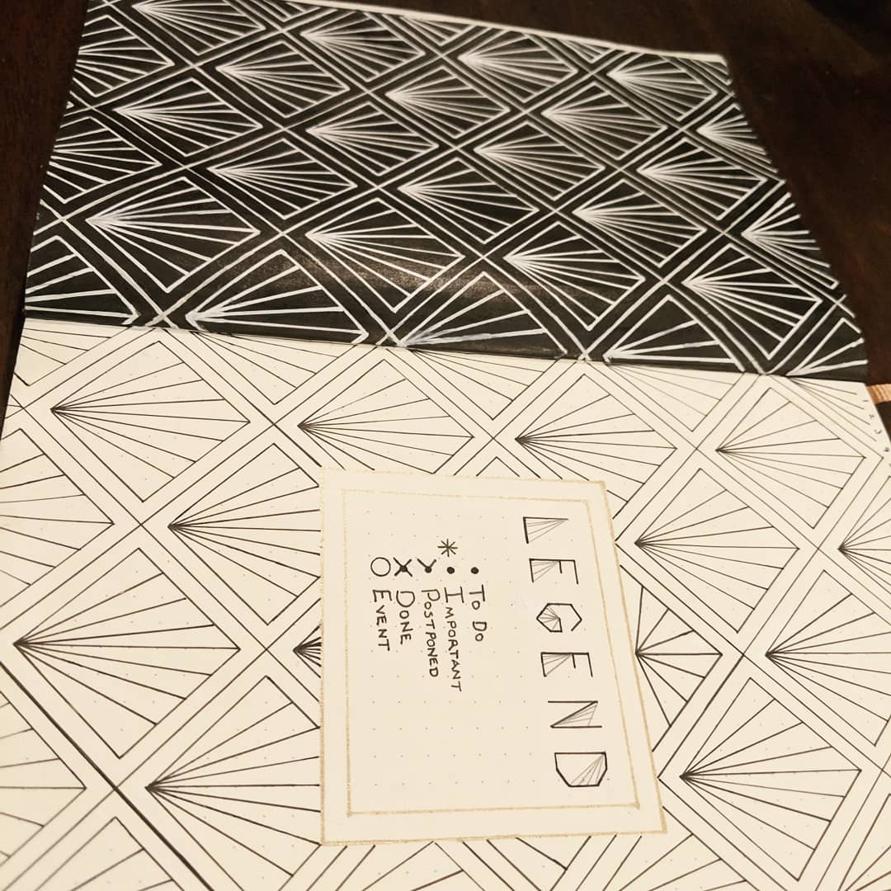
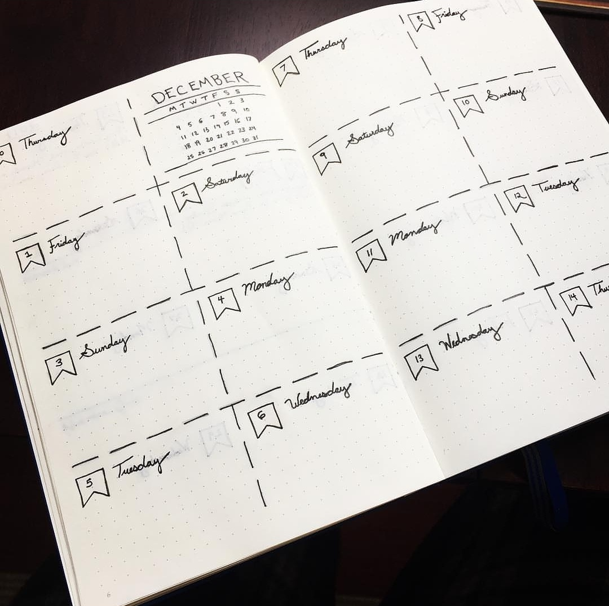
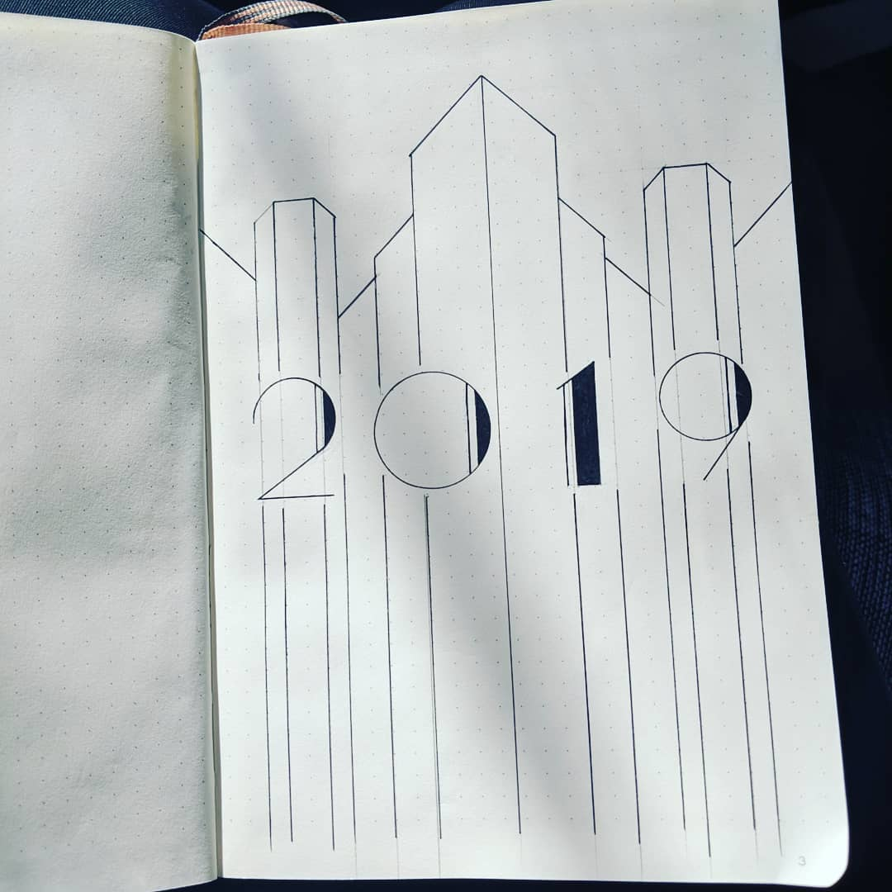

This year, I wound up getting a gold Leichturm 1917. I knew art deco would fit perfectly with the shiny gold cover.

I then remembered the poster for <em>Metropolis</em>.

It's such a bold, imposing illustration that sticks in your mind. I knew I wanted to allude to it somehow.

It was a good day. I listened to Siouxsie and the Banshees while busting out these spreads in time for 2019. Quite happy with how it turned out!

<video controls loop autoplay width="100%">
  <source src="img/2018-12-27/bujo-flip-through.mp4" type="video/mp4">
  Your browser does not support the video tag.
</video>

## 2019 Yearly Spread

## Legend Spread

## Monthly Spread

This is the monthly spread I always mock up. Super simple and doesn't take that long to draw. I find it's just enough space for each day.

## Behind the Scenes

<video controls loop autoplay width="100%">
  <source src="img/2018-12-27/bujo-process.mp4" type="video/mp4">
  Your browser does not support the video tag.
</video>

