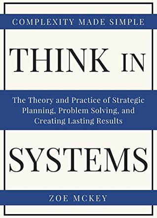
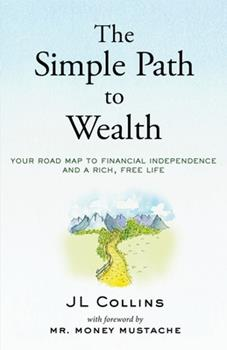
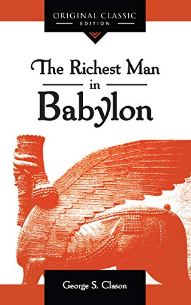
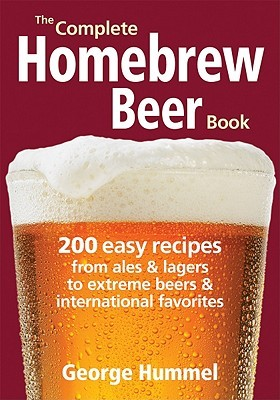
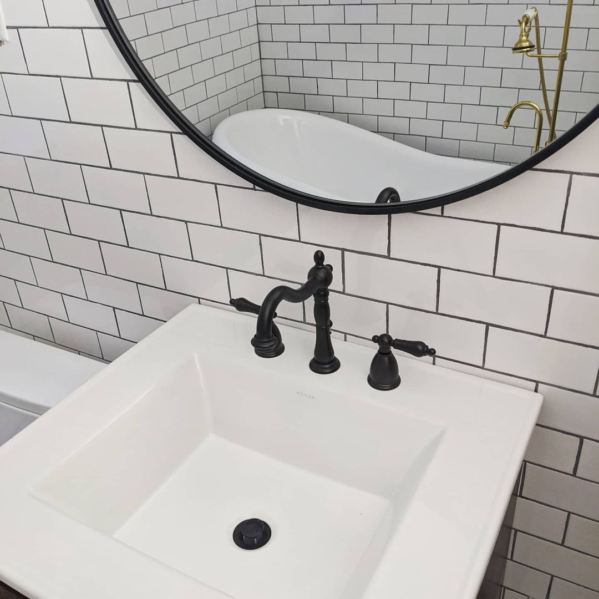
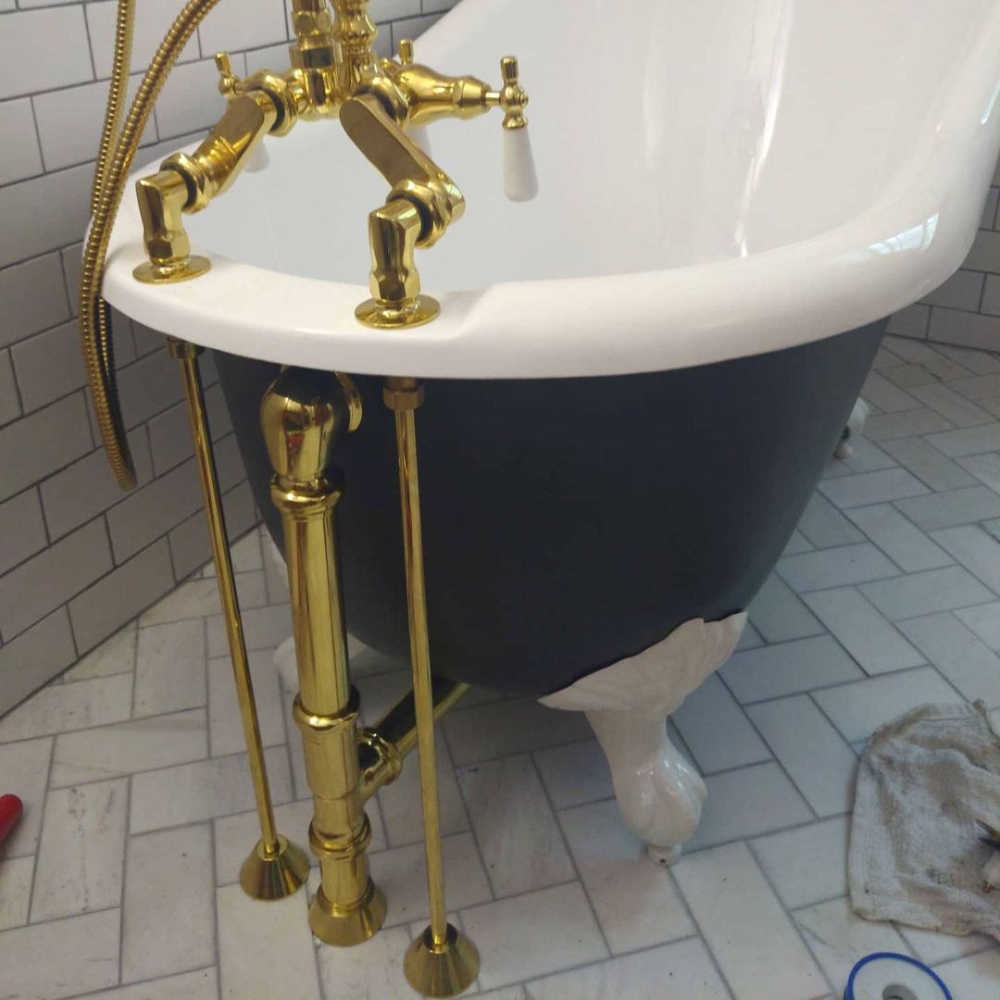
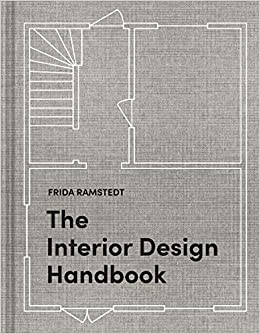
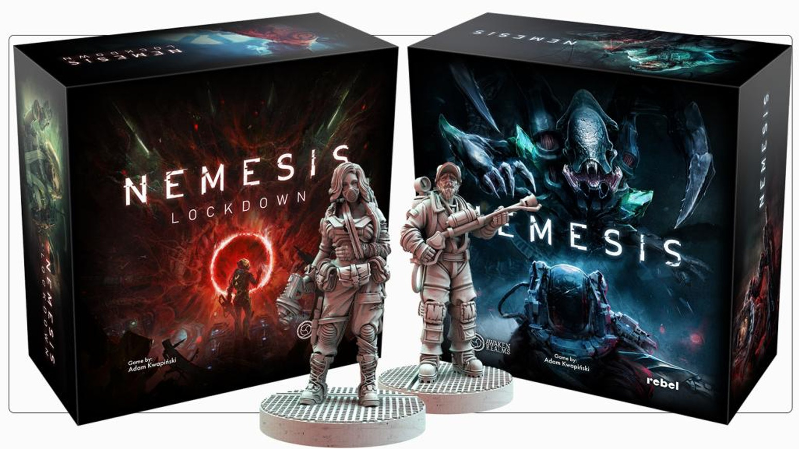
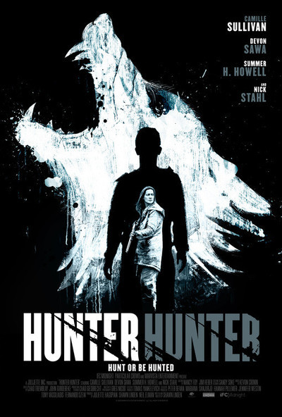
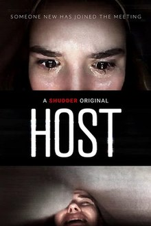

Jeeeeesus, 2020. What a year.

That said, I don't want to focus on or summarize all the terrible things that happened this year. You were there. Instead, I want to focus on some of the silver linings of this year for me, personally, as I mostly hunkered down avoiding all of society.

The news often got to be too much for me, so I found myself withdrawing an awful lot more than usual. Eventually, I realized that _making things_ and learning things was an excellent way to distract myself from the onslaught of news, the paranoia of basic life tasks, and the absolute existential nightmare going on in the world around me. It got me into my flow state.

I stopped using my phone as an alarm clock so that I wasn't bombarded by news and other notifications first thing in the morning. I now go some weekends without so much as looking at my phone until several hours after waking up; I don't miss it. I also removed most of my social media. I have an Instagram still and follow artists, calligraphers, contractors, and other creative people — I still consider Instagram a positive source of inspiration so it's here to stay for now. ✅

In general, I'm trying to be more mindful of what actually "sparks joy" and gets me into my flow state versus what aggravates me or numbs my creativity. It's definitely tough to realize when something is draining you in the moment, but I'm trying.

## Technical

So, all that said, that's the genesis for this whole blog!

I wanted to noodle around with <a href="https://www.gatsbyjs.com/" target="_blank">Gatsby</a>, <a href="https://www.netlify.com/" target="_blank">Netlify</a>, and some other tools (e.g. <a href="https://percy.io/" target="_blank">Percy</a> for visual regression) for a while, so this blog acted as a nice holiday break playground to get my feet wet. 🤓

I started a new job as a Senior Software Engineer in February earlier this year, and have already learned a _ton_. My workplace and colleagues have been superb, and I'm grateful and humbled to have kept steady employment. I'm part of a platform team that works with a React-based design system which, at the time of writing, hundreds of engineers use and rely on. Thinking in systems has been a critical mental shift which, oddly enough, reminds me of my days in the biochemistry lab where you were constantly aiming for a closed system free of confounding variables.

To get my head in the game, I read a few systems-thinking books this year, including <em><a href="https://www.goodreads.com/book/show/39932364-think-in-systems" target="_blank">Think in Systems</a></em> by Zoe McKey. I also participated in this year's <a href="https://www.adventofcode.com" target="_blank">Advent of Code</a> challenge, a 25-day challenge of two algorithmic puzzles per day. I wrote mine in TypeScript. Though typed languages aren't new to me, TypeScript was — I'm digging it.

  

I also got deep in the woods with documentation tools, mostly <a href="https://storybook.js.org/" target="_blank">Storybook</a>.

## Personal Finance

We had tried working with a fiduciary a while back but the situation fired off red flags left and right. We were pressured into opening a brokerage and life insurance policy because, turns out, this person would get a substantial kickback. (We didn't <em>actually</em> open those accounts, but the suggestion raised some eyebrows.)

I broke off that relationship and left that experience annoyed. This year, I decided to take matters into my own hands. It's just math, right?

I had been vaguely interested in the FIRE movement, but not exactly sure how to start. I joined my workplace's personal finance club, an employee-run group that meets monthly to chat finance and host knowledgable presenters. On the group's recommendation, I read <em><a href="https://www.goodreads.com/book/show/30646587-the-simple-path-to-wealth" target="_blank">The Simple Path to Wealth</a></em>, which was instrumental in helping me change my financial habits.

  

I started using <a href="https://ynab.com/referral/?ref=HoEL_-QCt-wEWoXQ&utm_source=customer_referral" target="_blank">You Need a Budget</a> (YNAB), which gives each dollar a "job," as they say, and have been working towards tackling my debt and not spending unnecessarily. It's given me that nice breath of clarity I'd needed, and I don't feel guilty about moving money around if I need to, as I have with other budgeting strategies.

I also read <em><a href="https://www.goodreads.com/book/show/1052.The_Richest_Man_in_Babylon" target="_blank">The Richest Man in Babylon</a></em>. This book was less strategic and more about shifting your mindset, through a series of parables, to develop practical savings strategies and to be consistently mindful of what is essential versus what's not. I do keep a few of its strategies in my back pocket still when I'm able, such as saving 10% of any revenue, no matter how small.

  

I'm really enjoying making financial plans and projections, and I've already noticed several opportunities to remove services I wasn't using or to follow up with companies about mysterious extra charges I likely wouldn't have noticed before.

I was even able to pay off all my credit card debt throughout the year. 🎉 Still quite a bit of debt to go, but that first step is monumental.

## Health &amp; Fitness

At the end of last year, I was working at a startup where my health — physical and mental — was abysmal. I was waking up around 5am every day (even on weekends), not really moving, and working typically over 12 hours each day without a lunch break. Even so, I kept tracking my weight, nutritional habits, and other physical stats, as I'd done before. Looking back at my weight chart from around that time has me all 😱 📈. There's a spike — really no mystery what happened there. I also lost a lot of muscle mass, which is personally more unfortunate because I'd worked so hard lifting weights in the years prior. 💪

At the time, I was happy to sacrifice my health in order to get things done but, in retrospect, I really shouldn't have. That was a major blow and a lesson I expect will stick with me.

So, fast-forward to the start of 2020, pre-pandemic. I have a cool new job. I'm determined to get healthier. I start going to the gym again and eating more nutritious "real food". I set aside time for myself and let my strength levels ramp back up slowly.

I buy a walking-speed-only desk treadmill (thanks to some YNAB budgeting first, of course!) so I can walk during meetings. At this time, lockdowns are beginning. Luckily, some of my coworkers are also interested in keeping physically fit. A few start offering online sessions: Barre, general strength training, sculpt yoga, and dance, to name a few. I was able to try tons of new workouts I ordinarily wouldn't have from home alongside my gracious coworkers.

Now, at the end of 2020, my body fat is down and I've lost a little over 10 pounds. 💪 More importantly, I'm eating healthier and not drinking nearly as much. I'm also finally settling into my new job. I was admittedly not in a great place mentally at first given my recent rough startup experience and then COVID.

## Brewing

I brewed beer! Technically I've brewed several beers before, but the last time I did was about a decade ago. Right now I'm brewing a colonial porter, which should be ready around February 2021.

Just as I did ten years ago, I'm going by the recipes in <em><a href="https://www.goodreads.com/book/show/11095467-the-complete-homebrew-beer-book" target="_blank">The Complete Homebrew Beer Book</a></em> by George Hummel.

  

I used malt extract since it had been a while, but I'm going to take a shot at cracking the grains next time. In the interest of shopping local, I bought all my ingredients and any additional equipment from my local <a href="http://www.mybeersoftheworld.com/" target="_blank">Beers of the World</a>.

## House Renovation

We moved into a family house earlier this year which needs some renovation love. Pre-pandemic, we were going to hire someone to renovate the bathroom, but then that fell through with all the uncertainty. Because the bathroom floor was literally rotting through to the basement (😬), we decided to learn all of this ourselves and _hop to it_.

Thanks to indiscriminate amounts of <em>This Old House</em>, <em>Home Town</em>, and other renovation gems, we learned as we went and have a functional bathroom now! 🎉 We wound up replacing the subfloor, knocking out a connected closet to expand the entire footprint, replacing rotted floor plates, tiling, replacing all of the plumbing, replacing the tub and shower, and everything in between. It was _a lot_.

### Before

Apologies for the gross before photos (🤮), but just to illustrate how urgently we needed to repair the floor:

There was also carpeted flooring, and we discovered several rotted floor plates and other structural 2x4s as we started to peel back the layers of the bathroom.

### After

Still need to paint but things are structurally sound. 💃

I'm really proud of all we accomplished. It was a <em>ton</em> of hard labor and unexpected hurdles, but we made it through. Plus, if we wind up contracting someone in the future, now we know an awful lot more about the terminology and processes. In my opinion we'll be able to speak more competently and knowledgably with a construction professional.

I also started reading <em><a href="https://www.barnesandnoble.com/w/the-interior-design-handbook-frida-ramstedt/1136319520" target="_blank">The Interior Design Handbook</a></em>, a beautiful Scandinavian book on interior design principles.

  

## Games

In our housebound life, we played a lot of chess and Nemesis. I was pumped that, earlier this year, Nemesis dropped another <a href="https://www.kickstarter.com/projects/awakenrealms/nemesis-lockdown" target="_blank">Kickstarter</a> that I excitedly backed. It's a superb game and I'm excited for the first wave of shipments arriving around February.

  

## Music

Because we played lots of the sci-fi horror-leaning Nemesis, I frequently played atmospheric sci-fi movie soundtracks in the background.

Aside from that, I listened to lots of old favorites: Black Sabbaaaath 🤘, The Melvins, etc. I had tickets to see Uncle Acid and the Deadbeats in May, but that tour was obviously cancelled.

<iframe src="https://open.spotify.com/embed/playlist/37i9dQZF1EMbvx2gVluAfu" width="300" height="185" frameborder="0" allowtransparency="true" allow="encrypted-media"></iframe>

---

## Movies

Okay, I watched <em>loads</em> of movies this year, but these two releases capture the zeitgeist of 2020 in different ways.

### Hunter Hunter (2020)

  

Not for the faint of heart, this survival thriller is shot in the beautiful Canadian wilderness and involves only a handful of characters to really capture that isolated and arguably stranded tension. Even if you guess the premise halfway through, the ending will surprise you. It's incredibly dark, but extremely well done.

### Host (2020)

  

The perfect fun horror movie for 2020.

It's essentially about an evil spirit who joins a Zoom meeting. Yup. It's great.

## That's a wrap!

Well, 2020, you were an experience unlike any other, that's for sure.
