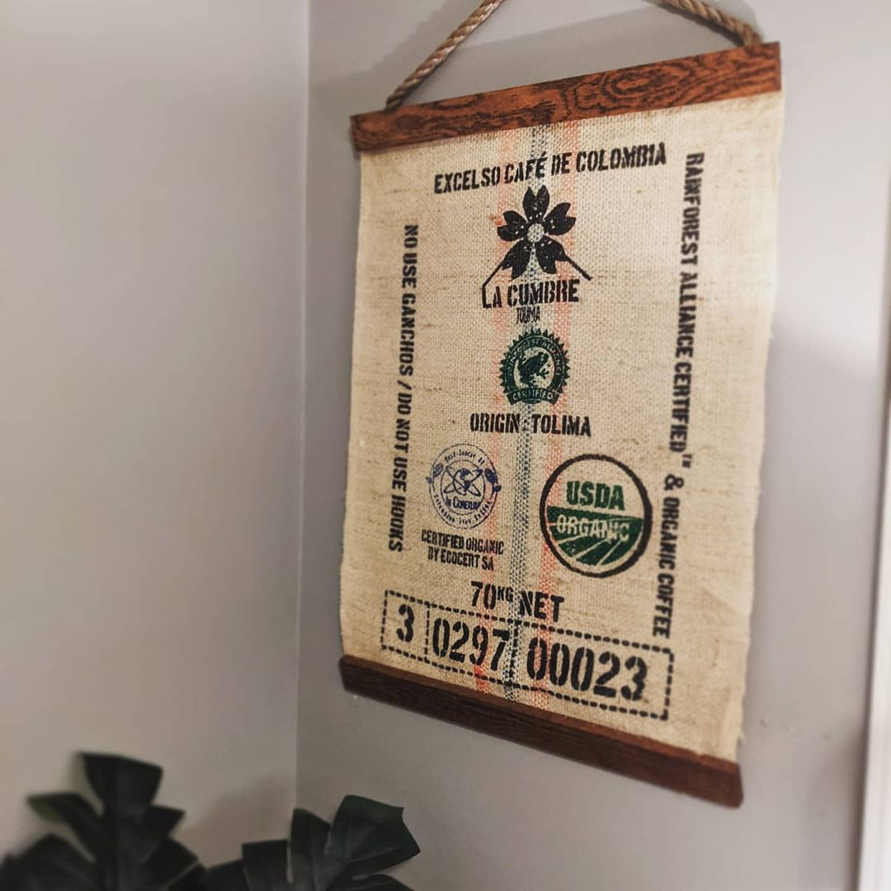
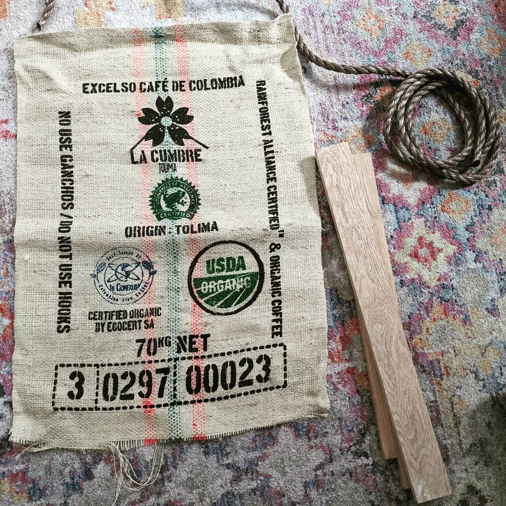

A fun and simple DIY decor project. 💅

---

My favorite local coffee roaster, <a href="https://www.glenedithcoffee.com" target="_blank">Glen Edith Coffee Roasters</a>, once included a burlap coffee bag in a shipment. I knew I wanted to make something out of it as soon as I saw it because the colors matched my office's color pallette perfectly. 😍

Luckily I found some really nice wood scraps and rope lying around. After ripping and staining the wood, then ironing the coffee bag, I used a heavy-duty stapler to attach the bag and rope.

> As a side note, Glen Edith has been wonderful during this whole pandemic. They offer weekly whole bean deliveries so I can still get my coffee fix and support the local Rochester, NY shops I miss dearly. Thanks GE! You all rule. ♥️
